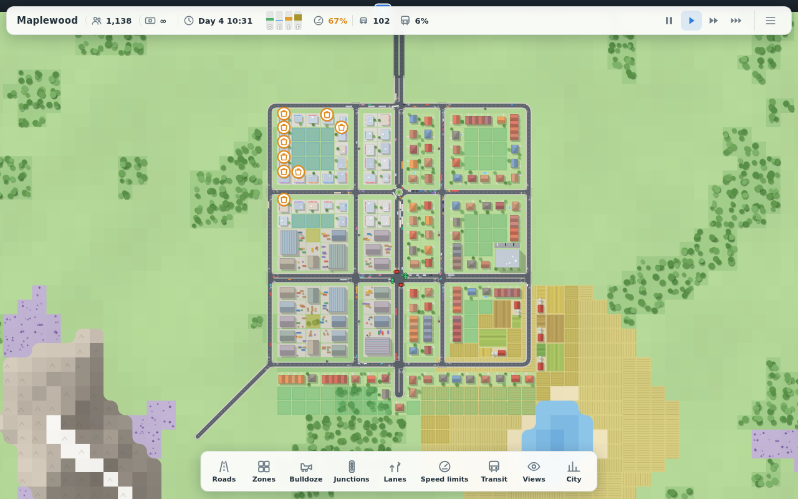
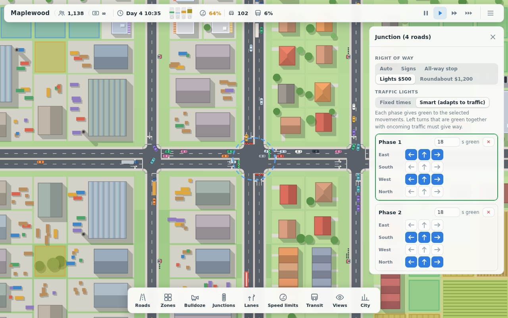
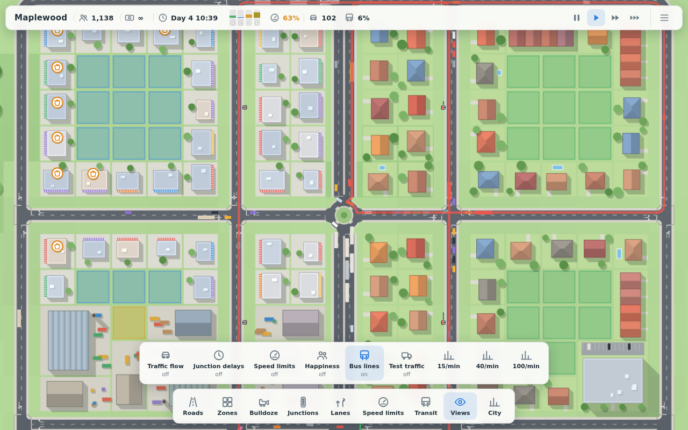

# Traffic City

A browser game about building a city and keeping its traffic moving. It combines Cities: Skylines-style zoning, city needs and a detailed junction editor (like the TM:PE mod) with the clean top-down look of Mini Motorways.



The game is a single HTML file with no server and no dependencies: build it once and open `dist/index.html` in any modern browser.

## Features

**Land and roads**
- Random maps with rivers, lakes, mountains, forests, fertile farmland and rich ground, each with its own colour.
- Roads on a grid with diagonals and curved corners.
  - Road types: street, one-way street, avenue, boulevard, highway, one-way highway and ramp.
  - Roads connect automatically, creating T-junctions and crossroads.
- Terrain rules:
  - a straight road across water becomes a bridge
  - one through rock becomes a tunnel
  - Ctrl-drag builds an overpass
- Roads that cross buildings demolish them. Bulldoze removes roads and buildings with a refund.

**Junctions and lanes**
- Junction control: automatic right of way, yield and stop signs, all-way stops, and traffic lights with an editable phase plan (fixed or traffic-actuated).
- Small and large roundabouts.
- **Lane manager**: choose which lane goes where at every junction. For example, two lanes into three exits: lane 1 left only, lane 2 straight and right.
  - Toggle lane arrows in the junction panel, or connect lanes directly on the map (L).
- Speed limits per road, truck bans and bus lanes.



**Traffic**
- Every car, truck and bus is simulated individually.
  - Drivers follow the car ahead, change lanes (including mandatory changes before a turn), obey signals, signs and speed limits, and do not block junctions.
- Route choice uses travel time, not distance. A longer highway wins over a short congested street, and drivers learn from live congestion and junction waits.
- Views for traffic flow, junction delays, speed limits, happiness and bus lines.

**City**
- Zone residential, commercial, industrial and farming land. Buildings grow when there is demand, level up when people are happy, and are abandoned when they are not.
- Residents need jobs and shops. Commutes and shopping trips are real trips on your roads, so bad traffic makes people unhappy.
- Freight: farms grow crops, factories turn crops (or rich ground) into goods, trucks deliver goods to shops, and surplus is exported through the highway.
- Taxes, road upkeep, a daily budget, milestones that unlock roads and tools, and a sandbox mode.

**Buses**
- Place stops on either side of a street and draw lines by clicking stops.
- People walk to a stop, wait, ride (with at most one transfer) and walk on. Good stops and frequent buses make them leave the car at home.



**Saving**
- Autosave every two minutes, Ctrl+S, a load dialog, and export/import of save files.

## Controls

| Input | Action |
|---|---|
| Left mouse | Use the selected tool; with no tool, click a car, road, junction or building for details |
| Right or middle drag, W A S D, arrow keys | Pan |
| Mouse wheel | Zoom |
| Space | Pause and resume |
| 1 · 2 · 3 | Game speed |
| Esc or right click | Cancel or close |
| R · Z · B | Roads · Zones · Bulldoze |
| J · L · K · T | Junctions · Lanes · Speed limits · Transit |
| V · C | Views · City statistics and budget |
| Shift while dragging a road | Straight line |
| Ctrl while dragging a road | Overpass |
| Enter / Backspace while drawing a bus line | Finish the line / remove the last stop |
| Ctrl+S | Save |

**Getting started**
1. Drag a road from a highway exit (the arrows at the map edge) into the land.
2. Zone homes along it, plus some industry and shops for jobs.
3. As the city grows, watch the traffic flow indicator and the junction delay view. Fix busy junctions with signs, lights, roundabouts and lane arrows, add alternative routes and buses.

## Development

Requirements: Node.js 22.

```sh
npm install
npm run dev        # development server with hot reload
npm run build      # single self-contained dist/index.html
npm test           # unit tests and headless traffic/city scenarios
npm run e2e        # build, then browser tests with Playwright
npm run typecheck
```

For the browser tests, install Chromium once with `npx playwright install chromium`.

**Code layout**

| Folder | Contents |
|---|---|
| `src/world` | Map generation and terrain |
| `src/roads` | Road layer, placement rules, and the compiler that turns roads into lanes, junction connectors and conflicts |
| `src/sim` | Vehicles (IDM car following, MOBIL lane changes), routing, junction control and traffic lights |
| `src/city` | Zones, buildings, citizens, freight and the economy |
| `src/transit` | Bus stops, lines, the journey planner and mode choice |
| `src/render` | Canvas 2D rendering with cached map chunks |
| `src/input`, `src/ui` | Tools, panels and the HUD |
| `tests/unit`, `tests/scenarios` | Vitest tests, including headless simulations (crossroads, lights, roundabouts, lane manager, city growth, buses, save games) |
| `tests/e2e` | Playwright tests of the built game |

All simulation code is independent of the DOM. `window.__game` exposes the running game for debugging and tests.

## Deployment

- `.github/workflows/ci.yml` typechecks, tests and builds every push, and uploads the game as a build artifact.
- `.github/workflows/pages.yml` publishes the game to GitHub Pages on pushes to `main`. Enable it once under **Settings → Pages → Source: GitHub Actions**.
